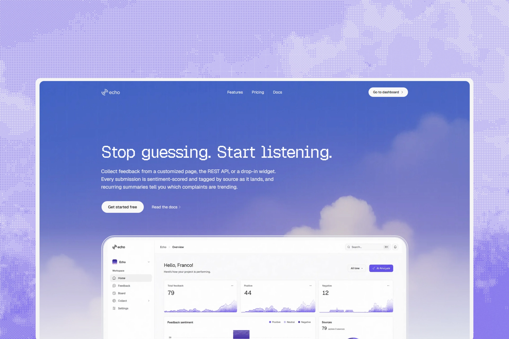

<h1 align="center">Echo</h1>
<p align="center">Feedback infrastructure for products that ship.</p>

<p align="center">
  <a href="https://echo.builders"><strong>Try it live</strong></a> ·
  <a href="documentation/overview.md">Docs</a> ·
  <a href="documentation/architecture.md">Architecture</a>
</p>

<p align="center">
  TypeScript · Bun · Next.js · Hono · tRPC · Postgres · Turborepo
</p>

<br />

Say hi to Echo — the one who listens to what your users are telling you, so
you don't have to dig through scattered messages to find it.

Drop a widget on your site or post to the API, and feedback lands in one
place: triaged on a shared list, tracked on a board, summarized with
AI-assisted digests when patterns start to repeat.

<br />

## Documentation

- [Overview](documentation/overview.md) — what Echo does and how it's built
- [Architecture](documentation/architecture.md) — how the pieces fit together
- [Contributing](documentation/contributing.md) — local setup

## Quick start

```bash
bun install
cp .env.example apps/server/.env
bun run db:push
bun run dev
```

See [contributing](documentation/contributing.md) for the full setup.

<br />

<p align="center">Built with Next.js, Hono, tRPC, and love.</p>
